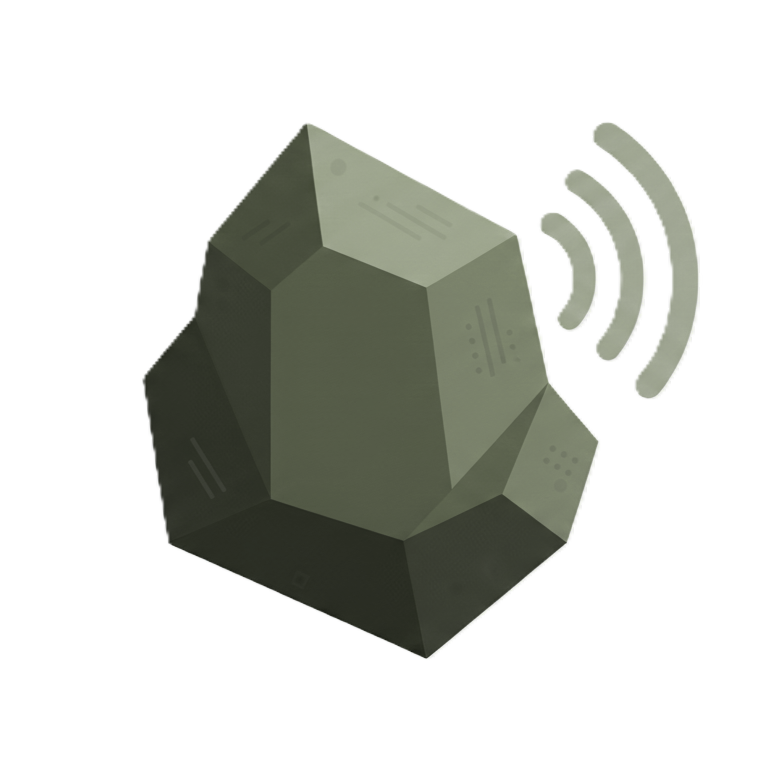

<p align="center">
  
</p>

<h1 align="center">Phonolite</h1>

<p align="center">
  Voice notes that become structured notes — right inside Obsidian.
</p>

<p align="center">
  Record audio, transcribe it locally or in the cloud, and get a clean, structured note with title, summary, sections, action items, and tags.
</p>

---

## How it works

1. **Record** — Hit the command or hotkey to start recording
2. **Transcribe** — Audio is transcribed on-device (Whisper via WebAssembly) or via the Phonolite cloud service, powered by the Whisper Model via Groq. Local transcription is private, while cloud transcription is available on all platforms and can be more accurate.
3. **Convert** — The transcript is sent to Phonolite's backend, which uses an LLM to produce a structured note, also powered by Groq. The backend returns a note with a title, summary, sections, action items, and tags.
4. **Write** — A formatted note lands in your vault, ready to use

In local mode, your audio never leaves your device. Only the transcript text is sent to the cloud for note generation.

## Features

- **On-device transcription** — Whisper runs locally via WASM. No audio uploaded. Privacy-first.
- **Cloud fallback** — If local transcription isn't available (mobile, no model downloaded, or force-cloud enabled), audio is transcribed server-side via Groq. We never store your audio data.
- **Structured output** — Every note gets a title, summary, organized sections, action items, and tags.
- **Customizable templates** — Control exactly how your notes are formatted with `{{token}}` placeholders.
- **Custom prompts** — Guide the LLM with your own system prompt (e.g., "Always respond in Spanish").
- **Retry tools** — Re-transcribe an audio file or re-convert a transcript from the command palette or settings.
- **Pipeline tracking** — Every recording is tracked from capture to final note, so retries know the full context.

## Getting started

1. Install the plugin from the Obsidian Community Plugins browser (search "Phonolite")
2. Get an API key at [phonolite.rocks/dashboard](https://phonolite.rocks/dashboard)
3. Paste your key in **Settings > Phonolite > API key**
4. Start recording with the **"Start recording"** command (`Ctrl/Cmd+Shift+R` or from the command palette)

On desktop, the Tiny Whisper model (~40 MB) downloads automatically in the background on first launch. You can use cloud transcription immediately while it downloads.

## Commands

| Command | Description |
|---|---|
| **Start recording** | Begin capturing audio |
| **Stop recording** | Stop and process through the full pipeline |
| **Transcribe audio file** | Pick an audio file from your vault and run the full pipeline |
| **Convert transcript to note** | Pick a transcript (.md) and convert it into a structured note |

## Settings

| Setting | Description |
|---|---|
| **API key** | Your Phonolite API key (`pk_...`) |
| **Server URL** | Backend URL (default: `https://phonolite.rocks`) |
| **Model size** | Tiny (~40 MB, faster) or Base (~145 MB, more accurate) |
| **Model storage path** | Where model files are cached on disk |
| **Force cloud transcription** | Skip local model, always use cloud |
| **Output folder** | Where generated notes are saved |
| **Recordings folder** | Where raw audio (.webm) is saved |
| **Transcripts folder** | Where raw transcripts (.md) are saved |
| **Note template** | Markdown template with `{{title}}`, `{{summary}}`, `{{sections}}`, `{{actionItems}}`, `{{tags}}`, `{{date}}`, `{{transcript}}` |
| **Custom prompt** | Optional instructions prepended to the LLM system prompt |

## Privacy

- **Local mode (desktop)**: Audio is transcribed on-device via Whisper. Only the transcript text is sent to the Phonolite backend for structured note generation. Your audio never leaves your machine.
- **Cloud mode (mobile or force-cloud)**: Audio is sent to Groq via the Phonolite backend for transcription, then converted into a structured note. Audio is not stored after processing.
- **No data persistence by AI providers** — All AI inference is powered by open-source models (Whisper, Llama) running on Groq. [Groq does not persist data](https://console.groq.com/docs/your-data) and our backend has zero-data-retention (ZDR) enabled. All traffic is routed through the Phonolite backend — your data is never sent directly to any third-party provider.
- **What we store** If you choose to use the service, we only store your email for login/auth, api keys you create to interact with the backend, and usage data (e.g. how many minutes transcribed) for billing purposes. We do not store your audio, transcripts, or generated notes. All audio and processing artifacts are stored locally in your vault, and you can delete them at any time.

## Pricing

| Tier | Audio | Notes |
|---|---|---|
| Free | 10 min/month | 3-month trial |
| Pro ($5/mo) | Unlimited | All features |

Manage your account at [phonolite.rocks/dashboard](https://phonolite.rocks/dashboard).

## Coming soon

- **Open-source backend** — A self-hostable version of the Phonolite backend, stripped of auth and billing. Bring your own API keys for any supported LLM and transcription provider (OpenAI, Groq, Anthropic, local Ollama, etc.). Point the plugin's **Server URL** setting at your own instance and run the entire pipeline on your own infrastructure. Works great if you have a [tailnet](https://tailscale.com/) set up for secure access to your self-hosted services.


## Manual installation

Copy `main.js`, `manifest.json`, and `styles.css` into your vault at:

```
.obsidian/plugins/phonolite/
```

## Development

```bash
npm install
npm run dev     # watch mode
npm run build   # production build
```

## License

[0-BSD](LICENSE)
